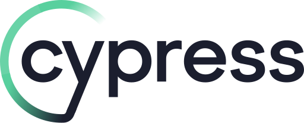

# Hi there! <image height="60" alt="img-hello" src="https://media3.giphy.com/media/v1.Y2lkPTc5MGI3NjExbW95M2I5d2pmcXcwaXg0aTB4ajRocW12dDJlYzRmOWU2eHN4ZW94OCZlcD12MV9pbnRlcm5hbF9naWZfYnlfaWQmY3Q9Zw/Wj7lNjMNDxSmc/giphy.gif" />

### I’m a manual QA engineer
- 🔭 I’m currently working on myself;
- 🌱 I’m currently learning English language;
- 💬 Ask me about anything, I am happy to help;
- ⚡ Fun fact: I have a degree in mining engineering;
- 📫 How to reach me:

     

### Languages and Tools:

  <code></code>
  <code></code>
  <code></code>
  <code></code>
   
  <code></code>
  <code></code>
  <code></code>
  <code></code>
  <code></code>
   
  <code></code>
  <code></code>
  <code></code>
  <code></code>
  <code></code>
  <code></code>
   

<!--
**Galina-T/Galina-T** is a ✨ _special_ ✨ repository because its `README.md` (this file) appears on your GitHub profile.

Here are some ideas to get you started:

- 🔭 I’m currently working on ...
- 🌱 I’m currently learning ...
- 👯 I’m looking to collaborate on ...
- 🤔 I’m looking for help with ...
- 💬 Ask me about ...
- 📫 How to reach me: ...
- 😄 Pronouns: ...
- ⚡ Fun fact: ...
-->
